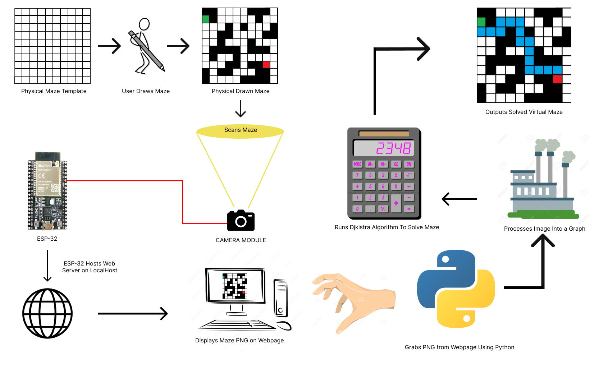

# MazeIt

MazeIt is a real life maze solver. You simply draw a maze on paper and lay it underneath the camera. With a click of a button the maze will instantly be scanned into the computer and the solution will be output to you on the screen. 

Here is a demonstration video:

## How It Works

I built it using Python and an ESP-32 Microcontroller. 

